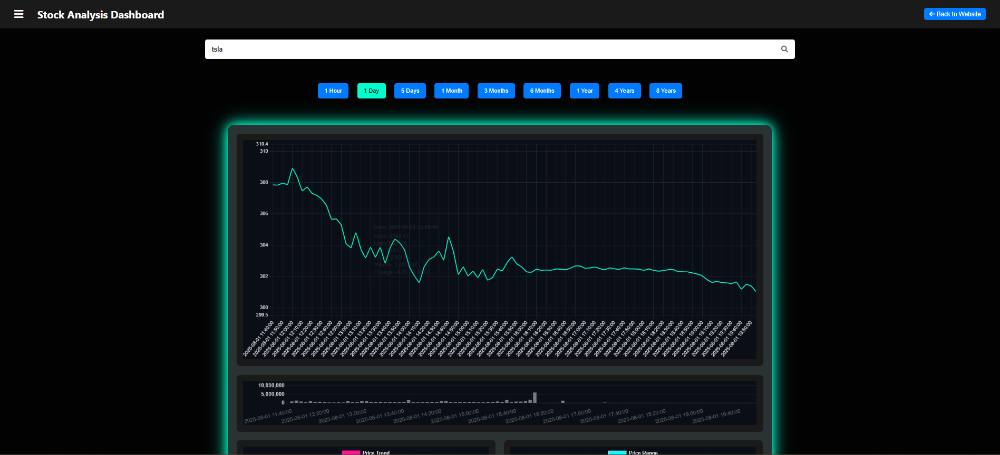

# Stock Market Dashboard

A web-based dashboard for real-time **stock analysis**, **price visualization**, and **future forecasting**, powered by a Flask backend and an interactive Chart.js frontend.

---

## 🚀 Features

- Search any stock ticker and visualize historic price data
- Multiple timeframe options (1min, 5min, hourly, daily, weekly, monthly)
- Interactive charts: line, trend, candlestick, range, and volume
- Predictive future forecasting powered by Prophet
- Loading animations, stats panel & responsive UI
- Sidebar navigation with tabbed views (Analysis, Forecasting, News)

---

## 🛠 Tech Stack

| Layer     | Tools / Libraries                                 |
|----------|----------------------------------------------------|
| Backend  | Python, Flask, Pandas, NumPy, Prophet               |
| API      | Alpha Vantage Stock Market API                     |
| Frontend | HTML, CSS, JavaScript                              |
| Charts   | Chart.js (financial + date-adapter extensions)      |

---

## 📸 Screenshot



---

## 📦 Installation

> Requirements: Python 3.8+ and a free Alpha Vantage API Key.

```bash
# 1. Clone the repository
git clone https://github.com/JEELDONGA18/Stock-Market-Dashboard
cd Stock-Market-Dashboard

# 2. (Optional) Create a virtual environment
python -m venv venv
source venv/bin/activate  # On Windows use: venv\Scripts\activate

# 3. Install backend requirements
pip install -r requirements.txt

# 4. Start the Flask API server
python app.py
```

---

## 💻 Usage

- Open `index.html` in your browser
- Enter a **company symbol** (e.g. `AAPL`, `GOOGL`, `TSLA`)
- Click duration buttons to load price charts
- Switch to the **Future Forecasting** tab for predictions
- Make sure `app.py` is running in the background (localhost)

---

## 📁 Project Structure

```
│
├── app.py
├── index.html
├── script.js
├── styles.css
├── requirements.txt
└── images/
    └── dashboard.png
```

---

## 🔑 API Key Setup

In `app.py`, replace this line with your own key:

```python
API_KEY = "YOUR_ALPHA_VANTAGE_KEY"
```

Get one for free at: <https://www.alphavantage.co>

---

## ✍️ Developed By

**Jeel Donga**
